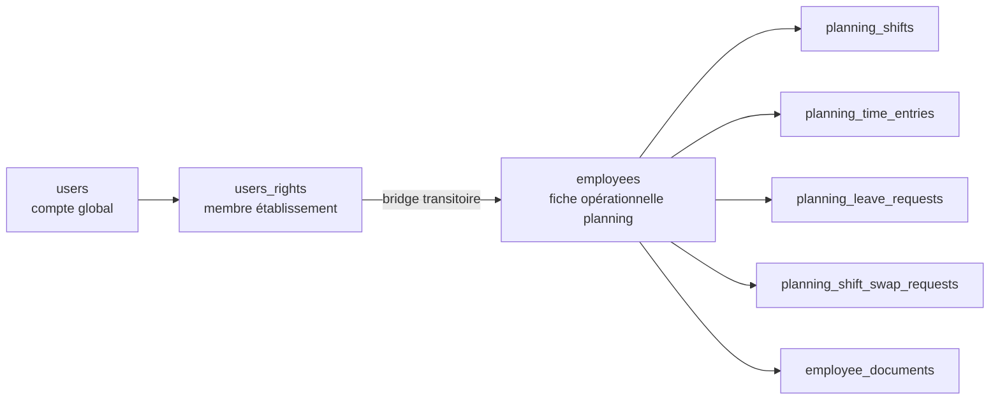

# Planning And Users Integration Guide

## Vue d'ensemble

Ce document centralise le fonctionnement backend de deux surfaces fortement liées :

- le module `planning`
- la gestion des `users` et des membres d'établissement via `users_rights`

L'objectif est de disposer d'une référence unique pour :

- comprendre le modèle de données
- intégrer correctement les endpoints back office et app
- connaître les payloads attendus
- connaître les structures renvoyées
- documenter les effets de bord et le fonctionnement "en background"

Ce guide complète :

- [ADMIN_USERS_EMPLOYEES_API.md](./ADMIN_USERS_EMPLOYEES_API.md)
- [planning-endpoints-test-plan.txt](../planning-postman-tests/planning-endpoints-test-plan.txt)
- [planning-members-self-service-test-plan.txt](../planning-postman-tests/planning-members-self-service-test-plan.txt)

## Architecture

### Pattern technique

Le code suit le pattern classique :

```text
Handler -> Service -> Repository
```

Pour `planning`, le package racine agrège plusieurs sous-modules :

- `settings`
- `refs`
- `employees`
- `documents`
- `schedule`
- `timeentries`
- `leave`
- `swaps`

Le package racine expose un facade unique, mais chaque sous-module conserve sa logique métier et ses DTOs.

### Diagramme de données



### Trois notions distinctes

#### 1. `users`

Compte global plateforme.

Responsabilités :

- identité globale
- email / téléphone / mot de passe
- MFA
- token utilisateur global
- profil personnel

#### 2. `users_rights`

Lien merchant-scoped entre un utilisateur global et un établissement.

Responsabilités :

- permissions merchant-scoped
- `admin`
- `login_enabled`
- `last_login_at` merchant-scoped
- profil RH / planning établissement

Depuis la migration 025, `users_rights` porte aussi les champs de fiche membre établissement :

- poste (`position_id`, `position_note`, `job_title`)
- rôle (`role`)
- contrat (`contract_type_code`, dates, volumes horaires)
- paie / coûts (`hourly_rate`, `gross_monthly_salary`, `employer_charges_pct`, `transport_cost`)
- note RH (`hr_comment`)

#### 3. `employees`

Entité opérationnelle utilisée par le module planning pour les affectations réelles :

- shifts
- time entries
- leave requests
- swap requests
- documents

Important : `users_rights` n'a pas remplacé `employees` dans les tables planning. Le planning continue de référencer `employee_id`.

### Bridge transitoire `employees.member_id`

`employees.member_id` reflète `users_rights.id`.

Ce bridge sert à relier progressivement le planning à la notion de membre établissement, sans casser les tables historiques qui utilisent encore `employee_id`.

Cas où il est alimenté :

- `POST /planning/employees/{id}/user-link`
- `DELETE /planning/employees/{id}/user-link`
- `POST /planning/employees`
- `PATCH /planning/employees/{id}` quand `user_id` change

Cas particulier important :

- `DELETE /users/{id}/merchant-link` désactive le lien merchant dans `users_rights` et efface `employees.user_id`
- cette opération ne supprime pas la fiche `employee`
- cette opération ne remet pas explicitement `employees.member_id` à `NULL`

Ce point est intentionnel dans l'état actuel du code : le bridge sert surtout à la résolution métier, pas à un nettoyage strict de l'historique.

## Conventions d'API

### Authentification

- la majorité des endpoints `planning` et `users` utilisent le middleware auth
- le token est envoyé via `Authorization: Bearer <token>`

### Permissions

#### Routes `planning`

Toutes les routes `planning` sont protégées par :

- `authMiddleware`
- `RequirePermission(HasPlanningAccess)`

#### Routes `users`

Les routes de gestion utilisateur sont protégées par :

- `authMiddleware`
- `RequirePermission(HasUserManagementAccess)` pour la gestion standard
- `RequirePermission(IsAdmin)` pour les actions sensibles

### Wrapper de réponse

Les handlers utilisent `models.SendJSON` et `models.SendErrorJSON`.

La forme top-level réelle est :

```json
{
  "id": "planning.list_employees",
  "data": {
    "status": "success",
    "employees": []
  }
}
```

En pratique, il faut distinguer deux niveaux :

- le wrapper top-level est toujours `{ id, data }`
- le contenu de `data` varie selon les handlers

Cas le plus fréquent sur `planning` et sur l'admin `users` :

- `data.status = success`
- `data.<resource>` ou `data.<collection>` contient le payload métier
- `data.pagination` est présent sur les listes paginées

Cas legacy encore présents sur certaines routes `users` self-service :

- `data` peut être directement un DTO brut
- ou un petit objet de type `{ "status": "success" }`
- ou un objet spécifique comme `{ "avatar_url": "..." }`

Les erreurs applicatives passent par `SendErrorJSON` et sont donc également enveloppées dans `{ id, data }`.

Exemple liste paginée :

```json
{
  "id": "users.list",
  "data": {
    "status": "success",
    "users": [],
    "pagination": {
      "total_items": 0,
      "total_pages": 0,
      "current_page": 1,
      "limit": 20
    }
  }
}
```

Exemple détail :

```json
{
  "id": "users.get",
  "data": {
    "status": "success",
    "user": {
      "user_id": "usr_..."
    }
  }
}
```

Dans la suite du document, les clés métier comme `users`, `user`, `employee`, `settings` ou `rights` désignent le contenu situé dans `data`.

### Pagination

Les endpoints paginés utilisent `page` et `page_size`.

Valeurs normalisées côté service :

- `page >= 1`
- `page_size >= 1`
- `page_size <= 100` pour `users`
- pagination planning normalisée par les helpers planning

## Auth, login, MFA et états d'accès

### Endpoint

- `GET /auth/login`
- `POST /auth/login`

### Payload d'entrée

DTO : `LoginRequestPayload`

```json
{
  "app": "WR_RECEPTION",
  "username": "",
  "password": "secret",
  "email": "john@example.com",
  "nfc": "",
  "pin": ""
}
```

### Structure de sortie

DTO principal : `LoginResponse`

Champs majeurs :

- `status`
- `enabled`
- `session`
- `user`
- `merchant`
- `access`
- `capabilities`
- `integrations`
- `SNOSettings`

Sous-structure importante : `session`

- `enabled`
- `merchant_id`
- `token`
- `mfa_status`
- `mfa_type`
- `merchants`

### Règles métier

Deux flags indépendants contrôlent l'accès :

- `users.enabled`
- `users_rights.login_enabled`

Comportement :

- si `users.enabled = false` : retour métier `account_disabled`
- si `users.enabled = true` mais `users_rights.login_enabled = false` : retour métier `user_not_allowed`

Important :

- `login_enabled = false` bloque le login sans masquer le membre dans les endpoints `/users`
- `users.enabled = false` fait apparaître le statut `disabled` dans la gestion users

### MFA back office

Le login regarde le header `X-App-Source`.

Si `X-App-Source = backoffice` et si le MFA est requis :

- le login peut renvoyer HTTP 202
- le statut métier devient `MFA_REQUIRED`
- la validation MFA se fait ensuite via les endpoints auth dédiés

### Effets de bord synchrones du login

En cas de login réussi :

- mise à jour de `users.last_login_at`
- mise à jour de `users_rights.last_login_at` pour le merchant courant

### Cache et fonctionnement interne

`AuthService.GetUserByToken` utilise :

- Redis si disponible
- `singleflight` pour éviter les cache stampedes

Il ne s'agit pas d'un worker asynchrone autonome, mais d'une optimisation interne à l'exécution des requêtes.

## Gestion users et membres établissement

### Surface des routes `users`

| Méthode | Route | Permission | Rôle fonctionnel |
|---|---|---|---|
| GET | `/users/profile` | auth | lire son propre profil |
| PATCH | `/users/profile` | auth | modifier son propre profil |
| POST | `/users/profile/avatar` | auth | uploader son avatar |
| GET | `/users/notifications` | auth | lire les notifications utilisateur |
| GET | `/users` | HasUserManagementAccess | lister les membres de l'établissement |
| POST | `/users` | HasUserManagementAccess | créer un user global + lien merchant |
| POST | `/users/create` | HasUserManagementAccess | alias de création |
| GET | `/users/linkable-search` | HasUserManagementAccess | chercher des users globaux non liés |
| GET | `/users/{id}` | HasUserManagementAccess | détail complet d'un membre |
| PATCH | `/users/{id}/member` | HasUserManagementAccess | mise à jour partielle de la fiche membre |
| POST | `/users/{id}/merchant-link` | HasUserManagementAccess | lier un user global existant |
| GET | `/users/{id}/rights` | HasUserManagementAccess | lire les droits merchant-scoped |
| PUT | `/users/{id}/rights` | HasUserManagementAccess | modifier droits + login_enabled |
| POST | `/users/{id}/force-reset-password` | IsAdmin | reset mot de passe + rotation tokens |
| DELETE | `/users/{id}/merchant-link` | IsAdmin | délier un user du merchant |
| GET | `/users/{user_id}/location` | auth | lire la localisation d'un user |
| PATCH | `/users/location` | auth | mettre à jour sa localisation |
| PATCH | `/users/reset-password` | auth | changer son mot de passe |

### Filtres de liste `/users`

Query params supportés :

- `search`
- `active`
- `linked_employee`
- `admin`
- `page`
- `page_size`

### Structures métier principales côté users

#### `CreateUserRequest`

```json
{
  "first_name": "Camille",
  "last_name": "Bernard",
  "username": "camille.member",
  "email": "camille.member@example.com",
  "password": "",
  "tel": "+336...",
  "merchant_id": null,
  "admin": false,
  "rights": {
    "admin": false,
    "login_enabled": true,
    "permissions": {}
  },
  "planning": {
    "position_id": "plan-pos-...",
    "role": "employee",
    "contract_type_code": "CDI"
  }
}
```

Règles :

- `password` peut être vide
- si vide, le backend génère un mot de passe aléatoire
- la création ne crée pas automatiquement une ligne `employees`
- la partie `planning` est stockée dans `users_rights`, pas dans `employees`

Valeurs par défaut appliquées lors de la création avec lien merchant :

- `rights.login_enabled = true`
- `planning.role = employee`
- `planning.contract_hours = 35`
- `planning.max_weekly_hours = 35`
- `planning.required_rest_days = 2`
- `planning.employer_charges_pct = 45`

#### `CreateUserResponse`

```json
{
  "user_id": "usr_..."
}
```

Réponse HTTP réelle : ce DTO est renvoyé dans `data` sans enveloppe métier supplémentaire de type `{ "status": "success" }`.

#### `MerchantUserRightsUpsertRequest`

```json
{
  "admin": false,
  "login_enabled": true,
  "permissions": {
    "access_reception": true,
    "access_delivery": false,
    "access_waiter": false,
    "print_merchant_cash_report": false,
    "open_cash_drawer": false,
    "manage_menu": false,
    "manage_plannings": true,
    "manage_users": false,
    "manage_settings": false,
    "manage_haccp": false,
    "view_reports": false,
    "export_reports": false,
    "view_financials": false,
    "export_financials": false,
    "manage_customers": false,
    "export_customers": false
  }
}
```

#### `MerchantUserPlanningUpsertRequest`

Champs supportés :

- `position_id`
- `position_note`
- `job_title`
- `role`
- `contract_type_code`
- `contract_start_date`
- `contract_end_date`
- `probation_end_date`
- `last_medical_checkup_date`
- `contract_hours`
- `max_weekly_hours`
- `required_rest_days`
- `sunday_premium` (bool — éligibilité de l'employé à la majoration dimanche, cf. `planning_settings.sunday_multiplier`)
- `night_premium` (bool — éligibilité de l'employé à la majoration nuit, cf. `planning_settings.night_shift_multiplier`)
- `hourly_rate`
- `gross_monthly_salary`
- `employer_charges_pct`
- `transport_cost`
- `hr_comment`

Règles :

- validation de `position_id` sur `planning_positions`
- validation de `contract_type_code` sur `sys_contract_types`
- refus des valeurs négatives pour les volumes / coûts / taux
- refus si `contract_end_date < contract_start_date`
- refus si `probation_end_date < contract_start_date`

#### `MerchantUserDetail`

Retour principal de `GET /users/{id}` et `PATCH /users/{id}/member`.

Structure logique :

- identité user globale
- flags `enabled` / `login_enabled`
- statut calculé (`active`, `login_disabled`, `disabled`)
- droits merchant-scoped
- lien employee éventuel (`employee_id`, `employee_name`)
- bloc `planning`

#### `MerchantUserPlanning`

Bloc renvoyé dans le détail user :

- `position_id`
- `position`
- `position_note`
- `job_title`
- `role`
- `contract_type_code`
- dates de contrat
- volumes horaires
- primes
- rémunération / coûts
- `hr_comment`

### Fonctionnement détaillé par endpoint users

#### `GET /users`

Retourne :

- `users: MerchantUserListItem[]`
- `pagination`

Chaque item expose notamment :

- `user_id`
- `first_name`
- `last_name`
- `email`
- `tel`
- `created_at`
- `last_login_at`
- `login_enabled`
- `enabled`
- `status`
- `merchant_rights_id`
- `admin`
- `permissions`
- `employee_id`
- `employee_name`

#### `GET /users/{id}`

Retourne :

- `user: MerchantUserDetail`

#### `GET /users/linkable-search`

Retourne :

- `users: LinkableUser[]`
- `pagination`

#### `GET /users/{id}/rights`

Retourne :

- `rights: MerchantUserRights`

#### `PATCH /users/{id}/member`

Met à jour uniquement la fiche membre établissement dans `users_rights`.

Ne modifie pas :

- le mot de passe
- les permissions
- la ligne `employees`

#### `PUT /users/{id}/rights`

Met à jour :

- `admin`
- `login_enabled`
- les permissions merchant-scoped

Effet visible dans les listes :

- `status = login_disabled` quand `enabled = true` mais `login_enabled = false`

Retourne :

- `rights: MerchantUserRights`

#### `POST /users/{id}/merchant-link`

Lie un user global existant au merchant courant.

Règles :

- le user global doit exister
- il ne doit pas déjà être lié au merchant
- `rights` et `planning` peuvent être fournis dès la liaison

Retourne :

- `rights: MerchantUserRights`

#### `DELETE /users/{id}/merchant-link`

Effets de bord :

- désactive le lien `users_rights.enabled`
- efface `employees.user_id` pour les employees du merchant liés à ce user
- journalise l'action dans l'audit service si celui-ci est branché

Ne supprime pas :

- le compte global `users`
- la fiche `employee`
- les enregistrements planning historiques

Retourne :

- `result: MerchantUserUnlinkResult`

Structure :

- `unlinked`
- `employee_links_cleared`

#### `POST /users/{id}/force-reset-password`

Effets de bord :

- met à jour `users.password`
- régénère `users.token`
- régénère tous les `users_rights.token` de l'utilisateur
- journalise l'action dans l'audit service si disponible

Retourne :

- `tokens_invalidated: true`

### Profil utilisateur et self-service users

Ces routes utilisent le même wrapper top-level `{ id, data }`, mais le contenu interne de `data` est plus ancien et moins homogène que sur les routes admin.

#### `UserProfileResponse`

```json
{
  "firstname": "John",
  "lastname": "Doe",
  "email": "john@example.com",
  "phone": "+336...",
  "address": "...",
  "street": "...",
  "city": "...",
  "postal_code": "75000",
  "country": "FR",
  "lat": 48.85,
  "lng": 2.35,
  "avatar": "https://...",
  "mfa_type": "sms",
  "email_verified": true,
  "phone_verified": false
}
```

#### `UpdateUserProfileRequest`

Champs modifiables :

- `firstname`
- `lastname`
- `email`
- `phone`
- `address`
- `street`
- `city`
- `postal_code`
- `country`
- `lat`
- `lng`
- `mfa_type`

Spécificité :

- le téléphone est reformaté en E.164 côté service
- si le pays n'est pas fourni, le pays du merchant courant est utilisé

`GET /users/profile` et `PATCH /users/profile` renvoient directement `UserProfileResponse` dans `data`.

`POST /users/profile/avatar` renvoie dans `data` :

```json
{
  "avatar_url": "https://..."
}
```

#### `PATCH /users/reset-password`

Payload :

```json
{
  "old_password": "old",
  "new_password": "newPassword123"
}
```

Effet de bord réel :

- rotation du token `users`
- rotation de tous les tokens `users_rights`

Réponse métier dans `data` :

```json
{
  "status": "success"
}
```

## Planning - surfaces fonctionnelles

### Routes disponibles

| Méthode | Route | Rôle |
|---|---|---|
| GET | `/planning/settings` | lire les settings planning merchant |
| PUT | `/planning/settings` | modifier les settings planning merchant |
| GET | `/planning/contract-types` | lister les types de contrat |
| GET | `/planning/attendance-sources` | lister les modes de pointage |
| GET | `/planning/event-types` | lister les types d'événements planning |
| GET | `/planning/positions` | lister les postes planning |
| POST | `/planning/positions` | créer un poste |
| GET | `/planning/positions/{id}` | détail poste |
| PATCH | `/planning/positions/{id}` | mise à jour poste |
| DELETE | `/planning/positions/{id}` | suppression logique poste |
| GET | `/planning/employees` | lister les employees planning |
| POST | `/planning/employees` | créer un employee planning |
| GET | `/planning/employees/{id}` | détail employee |
| PATCH | `/planning/employees/{id}` | mise à jour partielle employee |
| DELETE | `/planning/employees/{id}` | suppression logique employee |
| POST | `/planning/employees/{id}/user-link` | lier user global à employee |
| DELETE | `/planning/employees/{id}/user-link` | délier user global de l'employee |
| GET | `/planning/employees/{id}/documents` | lister les documents |
| POST | `/planning/employees/{id}/documents` | créer une fiche document |
| POST | `/planning/uploads/employee-documents` | uploader le binaire |
| GET | `/planning/employees/{id}/documents/{document_id}/download` | URL signée de téléchargement |
| DELETE | `/planning/employees/{id}/documents/{document_id}` | suppression document |
| GET | `/planning/employees/{id}/time-entries` | historique pointages |
| GET | `/planning/employees/{id}/time-entries/current` | pointage ouvert courant |
| POST | `/planning/employees/{id}/time-entries/start` | démarrer un pointage |
| POST | `/planning/employees/{id}/time-entries/stop` | arrêter un pointage |
| GET | `/planning/weeks` | lister les semaines |
| POST | `/planning/weeks` | créer une semaine |
| GET | `/planning/weeks/{id}` | détail semaine |
| PATCH | `/planning/weeks/{id}` | mise à jour semaine |
| DELETE | `/planning/weeks/{id}` | suppression logique semaine |
| GET | `/planning/weeks/{id}/shifts` | lister les shifts d'une semaine |
| POST | `/planning/weeks/{id}/shifts` | créer un shift |
| GET | `/planning/shifts/{id}` | détail shift |
| PATCH | `/planning/shifts/{id}` | mise à jour shift |
| DELETE | `/planning/shifts/{id}` | suppression logique shift |
| GET | `/planning/leave-requests` | lister les demandes de congé |
| POST | `/planning/leave-requests` | créer une demande de congé |
| GET | `/planning/leave-requests/{id}` | détail demande de congé |
| PATCH | `/planning/leave-requests/{id}` | modifier / approuver / rejeter |
| DELETE | `/planning/leave-requests/{id}` | suppression logique demande |
| GET | `/planning/shift-swap-requests` | lister les demandes d'échange |
| POST | `/planning/shift-swap-requests` | créer une demande d'échange |
| GET | `/planning/shift-swap-requests/{id}` | détail échange |
| PATCH | `/planning/shift-swap-requests/{id}` | modifier / approuver / rejeter |
| DELETE | `/planning/shift-swap-requests/{id}` | suppression logique échange |

### Clés de réponse planning les plus importantes

Les handlers planning suivent un naming stable dans `data` :

- `settings`
- `contract_types`
- `attendance_sources`
- `planning_event_types`
- `positions` / `position`
- `employees` / `employee`
- `documents` / `document`
- `weeks` / `week`
- `shifts` / `shift`
- `time_entries` / `time_entry`
- `leave_requests` / `leave_request`
- `shift_swap_requests` / `shift_swap_request`

## Référentiels planning

### `GET /planning/contract-types`

Retour :

- `contract_types: SystemRef[]`

Valeurs standard injectées par migration :

- `CDI`
- `CDD`
- `Extra`
- `Stage`
- `Apprenti`

### `GET /planning/attendance-sources`

Retour :

- `attendance_sources: SystemRef[]`

Valeurs :

- `pointage`
- `planning`

### `GET /planning/event-types`

Retour :

- `planning_event_types: SystemRef[]`

Valeurs standard :

- `holiday`
- `custom`
- `leave`

## Planning settings

### DTO `PlanningSettings`

Champs renvoyés :

- `id`
- `merchant_id`
- `labor_country_code`
- `min_daily_rest_hours`
- `min_break_minutes`
- `night_shift_start`
- `night_shift_end`
- `night_shift_multiplier`
- `holiday_multiplier`
- `sunday_multiplier`
- `allow_override_warnings`
- `attendance_source`
- `shift_swap_approval_mode`
- `created_at`
- `updated_at`

### DTO `PlanningSettingsUpdateRequest`

Tous les champs sont optionnels et patch-like malgré l'usage de `PUT`.

Note connexe : les overrides de jours fériés existent bien dans le périmètre planning, mais leurs routes sont exposées sous `/pos/settings/holidays` et non sous `/planning`.

DTOs associés :

- `PlanningHoliday`
- `PlanningHolidayOverridePatchRequest`

### Règles métier importantes

#### `attendance_source`

- `pointage` : les time entries manuels sont autorisés
- `planning` : les endpoints start/stop des time entries sont refusés

#### `shift_swap_approval_mode`

- `manager_required`
- `target_employee_required`

## Positions planning

### DTO `EmployeePosition`

- `id`
- `merchant_id`
- `label`
- `sort_order`
- `active`
- `employee_count`
- `created_at`
- `updated_at`

### DTOs d'entrée

#### `EmployeePositionCreateRequest`

- `label`
- `sort_order`
- `active`

#### `EmployeePositionUpdateRequest`

- `label`
- `sort_order`
- `active`

### Règles métier

- unicité métier du label par merchant
- suppression logique
- refus de suppression si poste encore utilisé

## Employees planning

### DTO `Employee`

Champs exposés :

- identité : `id`, `merchant_id`, `user_id`, `first_name`, `last_name`
- poste : `position_id`, `position`, `position_note`, `job_title`
- contact : `email`, `phone`
- contrat / RH : `role`, `contract_type_code`, dates, heures, primes, rémunération, `hr_comment`
- infos perso : `birth_date`, `gender`, `nationality`, `address`
- statut : `active`, `created_at`, `updated_at`, `deleted_at`

Champ interne non exposé JSON :

- `member_id`

### DTO `EmployeeCreateRequest`

Champs principaux :

- `user_id` optionnel
- `first_name`
- `last_name`
- `position_id`
- `position_note`
- `job_title`
- `email`
- `phone`
- `role`
- `contract_type_code`
- dates RH
- volumes horaires
- primes
- coûts / rémunération
- `active`

### DTO `EmployeeUpdateRequest`

Version partielle patchable du même profil.

### Listes et filtres

`GET /planning/employees` accepte :

- `search`
- `active`
- `position_id`
- `contract`
- `user_id`
- `unlinked`
- `page`
- `page_size`

### User link sur employee

#### `POST /planning/employees/{id}/user-link`

Payload :

```json
{
  "user_id": "usr_..."
}
```

Règles :

- le user doit être lié au merchant courant dans `users_rights`
- un autre employee actif du même merchant ne doit pas déjà porter ce `user_id`
- le bridge `member_id` est résolu et posé automatiquement

#### `DELETE /planning/employees/{id}/user-link`

Effet :

- `user_id = NULL`
- `member_id = NULL`

## Documents employés

### DTO `EmployeeDocumentUploadResponse`

```json
{
  "file_key": "wello_resto_private_storage/...",
  "file_url": "https://signed-url...",
  "content_type": "application/pdf",
  "file_name": "contrat.pdf"
}
```

### DTO `EmployeeDocumentCreateRequest`

```json
{
  "document_type": "contract",
  "name": "Contrat CDI",
  "file_key": "wello_resto_private_storage/...",
  "content_type": "application/pdf"
}
```

### DTO `EmployeeDocument`

- `id`
- `merchant_id`
- `employee_id`
- `document_type`
- `name`
- `file_url`
- `content_type`
- `created_at`
- `updated_at`

### Règles métier

- upload multipart champ `file`
- taille max : `10 << 20` soit 10 MiB
- content types acceptés :
  - `application/pdf`
  - `image/jpeg`
  - `image/png`
  - `image/webp`
- document types acceptés :
  - `contract`
  - `id`
  - `medical`
  - `other`

### Fonctionnement R2

- upload dans le bucket privé R2
- génération d'un `file_key` stable en base
- génération à la demande d'une URL signée
- TTL actuel de l'URL signée : 1 heure
- suppression best effort du fichier R2 quand le document est supprimé

## Semaines et shifts

### DTO `PlanningWeek`

- `id`
- `merchant_id`
- `label`
- `start_date`
- `end_date`
- `status`
- `notes`
- `created_at`
- `updated_at`

### DTO `PlanningWeekCreateRequest`

- `label`
- `start_date`
- `end_date`
- `status`
- `notes`

### DTO `PlanningWeekUpdateRequest`

- `label`
- `start_date`
- `end_date`
- `status`
- `notes`

### Règles semaines

- unicité métier d'une semaine par `start_date` au niveau merchant
- la validation est portée par le service, pas par une contrainte SQL forte de type produit fini
- suppression logique de la semaine

### DTO `PlanningShift`

- `id`
- `merchant_id`
- `week_id`
- `employee_id`
- `title`
- `shift_date`
- `start_time`
- `end_time`
- `break_minutes`
- `position`
- `location`
- `notes`
- `status`
- `created_at`
- `updated_at`

### DTO `PlanningShiftCreateRequest`

- `employee_id`
- `title`
- `shift_date`
- `start_time`
- `end_time`
- `break_minutes`
- `position`
- `location`
- `notes`
- `status`

### DTO `PlanningShiftUpdateRequest`

Version patchable du même objet.

### Règles shifts

- le shift doit appartenir aux bornes de la semaine
- validation du créneau horaire côté service
- refus si overlap avec un autre shift du même employee
- suppression logique

## Time entries

### DTO `PlanningTimeEntry`

- `id`
- `merchant_id`
- `employee_id`
- `shift_id`
- `attendance_source`
- `clock_in_at`
- `clock_out_at`
- `clock_in_note`
- `clock_out_note`
- `created_at`
- `updated_at`

### DTO `PlanningTimeEntryStartRequest`

- `shift_id`
- `clock_in_at`
- `clock_in_note`

### DTO `PlanningTimeEntryStopRequest`

- `entry_id`
- `clock_out_at`
- `clock_out_note`

### Endpoints

- `GET /planning/employees/{id}/time-entries`
- `GET /planning/employees/{id}/time-entries/current`
- `POST /planning/employees/{id}/time-entries/start`
- `POST /planning/employees/{id}/time-entries/stop`

### Spécificité `me`

Le paramètre `{id}` peut être :

- un vrai `employee_id`
- la valeur spéciale `me`

Résolution de `me` :

```text
auth.UserLoginRow.MerchantRightsID
-> employees.member_id
-> employees.id
```

### Règles métier

- un seul pointage ouvert par employee
- `start` interdit si `attendance_source != pointage`
- si `shift_id` est fourni :
  - le shift doit exister
  - le shift doit être affecté au même employee
  - le jour du pointage doit correspondre au jour du shift
- `stop` exige un `clock_out_at > clock_in_at`

## Leave requests

### DTO `PlanningLeaveRequest`

- `id`
- `merchant_id`
- `employee_id`
- `leave_type`
- `start_date`
- `end_date`
- `status`
- `reason`
- `manager_note`
- `requested_by_user_id`
- `processed_by_user_id`
- `processed_at`
- `created_at`
- `updated_at`

### DTO `PlanningLeaveRequestCreateRequest`

- `employee_id`
- `leave_type`
- `start_date`
- `end_date`
- `reason`

### DTO `PlanningLeaveRequestUpdateRequest`

- `leave_type`
- `start_date`
- `end_date`
- `status`
- `reason`
- `manager_note`

### Types autorisés

- `paid`
- `unpaid`
- `sick`
- `other`

### Statuts autorisés

- `pending`
- `approved`
- `rejected`
- `cancelled`

### Spécificité `me`

Les endpoints leave acceptent `employee_id = me` dans :

- `GET /planning/leave-requests?employee_id=me`
- `POST /planning/leave-requests`

### Règles métier

- validation des dates
- refus si `end_date < start_date`
- lors d'une approbation, si des shifts sont encore affectés à cet employee sur la période, la demande est rejetée avec conflit

## Shift swap requests

### DTO `PlanningShiftSwapRequest`

- `id`
- `merchant_id`
- `requester_employee_id`
- `requester_shift_id`
- `target_employee_id`
- `target_shift_id`
- `status`
- `reason`
- `manager_note`
- `requested_by_user_id`
- `processed_by_user_id`
- `processed_at`
- `created_at`
- `updated_at`

### DTO `PlanningShiftSwapRequestCreateRequest`

- `requester_employee_id`
- `requester_shift_id`
- `target_employee_id`
- `target_shift_id`
- `reason`

### DTO `PlanningShiftSwapRequestUpdateRequest`

- `status`
- `reason`
- `manager_note`

### Statuts autorisés

- `pending`
- `approved`
- `rejected`
- `cancelled`

### Spécificité `me`

Les endpoints swaps acceptent `me` dans :

- `GET /planning/shift-swap-requests?requester_employee_id=me`
- `GET /planning/shift-swap-requests?target_employee_id=me`
- `POST /planning/shift-swap-requests` pour `requester_employee_id`
- `POST /planning/shift-swap-requests` pour `target_employee_id`

### Règles métier

- requester et target doivent être différents
- requester shift et target shift doivent être différents
- chaque shift doit être affecté au bon employee
- approbation `manager_required` : validation classique manager/admin
- approbation `target_employee_required` : le target employee doit approuver lui-même

### Validation de l'approbateur cible

Quand `shift_swap_approval_mode = target_employee_required`, l'approbation compare :

- `auth.UserLoginRow.MerchantRightsID`
- avec `employees.member_id` de `target_employee_id`

### Effet de bord lors d'une approbation

Une approbation effectue, dans une transaction SQL :

- réaffectation du `requester_shift` au `target_employee`
- réaffectation du `target_shift` au `requester_employee`
- mise à jour de la demande de swap avec `status=approved`

Si une des validations de conflit échoue, toute l'opération est annulée.

## Fonctionnement self-service avec `me`

Le backend supporte maintenant une référence self-service commune : `me`.

But :

- éviter que les clients back office / app aient toujours besoin de connaître `employee_id`
- permettre à un membre connecté d'agir pour sa propre fiche planning

### Résolution technique

Le helper partagé fait :

```text
si valeur != "me" -> on garde l'employee_id tel quel
si valeur == "me" ->
  auth context -> MerchantRightsID -> employees.member_id -> employees.id
```

### Endpoints compatibles `me`

- `GET /planning/leave-requests?employee_id=me`
- `POST /planning/leave-requests` avec `employee_id = me`
- `GET /planning/employees/me/time-entries`
- `GET /planning/employees/me/time-entries/current`
- `POST /planning/employees/me/time-entries/start`
- `POST /planning/employees/me/time-entries/stop`
- `GET /planning/shift-swap-requests?requester_employee_id=me`
- `GET /planning/shift-swap-requests?target_employee_id=me`
- `POST /planning/shift-swap-requests` avec `requester_employee_id = me`
- `POST /planning/shift-swap-requests` avec `target_employee_id = me`

Condition nécessaire :

- le user connecté doit être rattaché à un `users_rights`
- ce `users_rights.id` doit correspondre à `employees.member_id` d'un employee actif du merchant

## Fonctionnement "en background" et effets de bord

### Ce qu'il n'y a pas

Il n'existe pas, dans ce périmètre planning/users, de worker autonome ou de cron métier dédié qui transformerait les données sans appel HTTP explicite.

Le comportement est principalement synchrone, requête par requête.

### Ce qu'il y a malgré tout en arrière-plan technique

### 1. Cache auth Redis

- lookup token -> user mis en cache Redis
- invalidation possible via rotation des tokens
- `singleflight` limite les appels simultanés identiques sur un même token

### 2. MFA

- codes gérés via Redis
- canaux possibles email / SMS suivant configuration
- surtout utilisé pour le back office

### 3. R2 privé pour les documents employees

- upload binaire dans le bucket privé
- persistance du `file_key` en base
- génération d'URL signée à la demande

### 4. Rotation des tokens lors du changement de mot de passe

Quand un mot de passe est modifié :

- `users.token` est régénéré
- tous les `users_rights.token` de l'utilisateur sont régénérés

### 5. Audit logging

Si `auditService` est branché, certaines actions sont journalisées :

- `force_reset_password`
- `unlink_merchant_user`

### 6. Transactions SQL

Utilisation notable :

- `CreateUser` + upsert du lien merchant
- `LinkMerchantUser`
- `UnlinkMerchantUser`
- approbation des shift swaps

## Limites et état actuel du module

### Ce qui est déjà vrai

- `users` reste la source de vérité globale pour l'identité et l'authentification
- `users_rights` est la source de vérité merchant-scoped pour les droits et la fiche membre établissement
- `employees` reste la source opérationnelle pour les objets planning existants

### Ce qui est transitoire

- le planning n'est pas encore entièrement rebranché directement sur `users_rights`
- les tables de production planning continuent de porter `employee_id`
- `employees.member_id` sert de bridge de transition

### Implication intégration front

Pour le back office et l'app :

- la gestion membre établissement doit partir de `/users`
- les opérations planning historiques continuent de viser `/planning/...`
- les cas self-service peuvent déjà utiliser `me` sur les endpoints documentés ci-dessus

## Recommandations d'intégration

### Pour le back office

- utiliser `/users` comme surface d'administration des membres
- utiliser `/users/{id}/member` pour le profil RH/planning établissement
- utiliser `/users/{id}/rights` pour les permissions et `login_enabled`
- n'utiliser `/planning/employees` que pour les besoins opérationnels planning réels

### Pour l'app / self-service

- privilégier les endpoints `me` quand disponibles
- ne pas supposer que `employee_id` est toujours connu côté client
- tenir compte de `attendance_source` avant d'afficher les actions de pointage manuel
- tenir compte de `shift_swap_approval_mode` avant d'afficher les actions d'approbation

## Annexes utiles

### Statuts users calculés

- `active`
- `login_disabled`
- `disabled`

### Valeurs `attendance_source`

- `pointage`
- `planning`

### Valeurs `shift_swap_approval_mode`

- `manager_required`
- `target_employee_required`

### Valeurs `leave_type`

- `paid`
- `unpaid`
- `sick`
- `other`

### Valeurs `leave_status` / `swap_status`

- `pending`
- `approved`
- `rejected`
- `cancelled`

### Types de document employee acceptés

- `contract`
- `id`
- `medical`
- `other`

### MIME types acceptés pour l'upload document

- `application/pdf`
- `image/jpeg`
- `image/png`
- `image/webp`